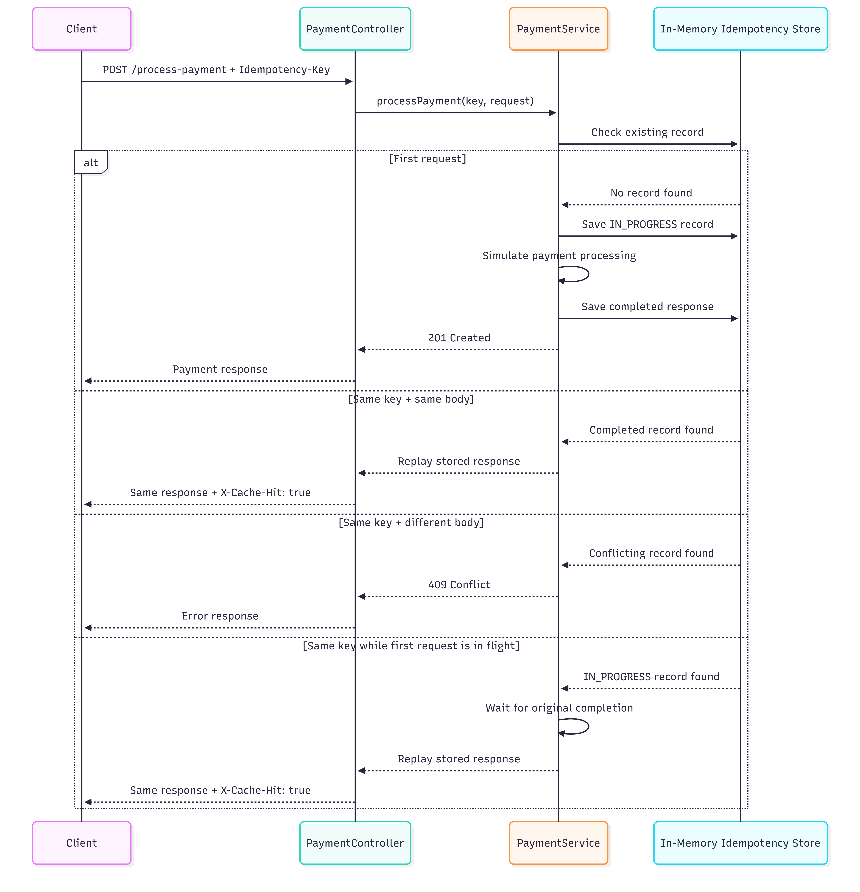

# Idempotency Gateway

A Spring Boot payment API that prevents duplicate charges by enforcing idempotent request handling with the `Idempotency-Key` header.

## Overview

This service solves the common retry problem in payment systems: if a client resends the same payment request because of a timeout, the gateway processes it only once and replays the original response for safe retries.

## Architecture Diagram



## Tech Stack

- Java 17
- Spring Boot
- Bean Validation
- In-memory `ConcurrentHashMap` store

## Setup Instructions

1. Open a terminal in `backend/idempotency-gateway`
2. Start the app locally:

```bash
mvn spring-boot:run
```

If Maven wrapper works in your environment, you can also use:

```bash
./mvnw spring-boot:run
```

The API runs on:

```text
http://localhost:8080
```

### Start with Docker

Prerequisite: make sure Docker Desktop or Docker Engine is running.

Build and run with Docker Compose:

```bash
docker compose up --build
```

Or build and run manually:

```bash
docker build -t idempotency-gateway .
docker run -p 8080:8080 idempotency-gateway
```

Stop the containerized app:

```bash
docker compose down
```

## API Documentation

### `POST /process-payment`

Required header:

```text
Idempotency-Key: payment-001
```

Request body:

```json
{
  "amount": 100,
  "currency": "GHS"
}
```

### Success: first request

- Simulates processing with a 2-second delay
- Returns `201 Created`

Example response:

```json
{
  "message": "Charged 100 GHS",
  "idempotencyKey": "payment-001",
  "processedAt": "2026-04-26T10:13:08.420062800Z"
}
```

### Success: duplicate retry

- Same `Idempotency-Key`
- Same request body
- Returns the exact stored response immediately
- Adds:

```text
X-Cache-Hit: true
```

### Conflict: same key, different body

Returns `409 Conflict`

```json
{
  "error": "Conflict",
  "message": "Idempotency key already used for a different request body.",
  "timestamp": "2026-04-26T10:13:08.420062800Z"
}
```

### Bad request: missing header

Returns `400 Bad Request`

```json
{
  "error": "Bad Request",
  "message": "Idempotency-Key header is required.",
  "timestamp": "2026-04-26T10:13:08.420062800Z"
}
```

## Postman Test Cases

1. Send a request with a new idempotency key and valid body: expect `201 Created`
2. Send the same request again with the same key and body: expect cached replay with `X-Cache-Hit: true`
3. Reuse the same key with a different amount or currency: expect `409 Conflict`
4. Remove the `Idempotency-Key` header: expect `400 Bad Request`

## Design Decisions

- **Separated controller, service, DTO, model, and exception packages** for readability and maintainability
- **In-memory idempotency store** using `ConcurrentHashMap` for a lightweight challenge-friendly implementation
- **`CompletableFuture`-based in-flight handling** to avoid duplicate processing during concurrent retries
- **Structured error responses** through a global exception handler

## The Developer's Choice

I added **Docker support** as a production-minded improvement.

Why it matters:

- the service can be started consistently across machines
- reviewers can run the project with a single command
- the application is easier to package, share, and deploy in a real backend workflow

## Project Status

Implemented features:

- idempotent payment processing
- duplicate replay support
- conflict detection for mismatched retries
- in-flight duplicate request handling
- validation and global exception handling
