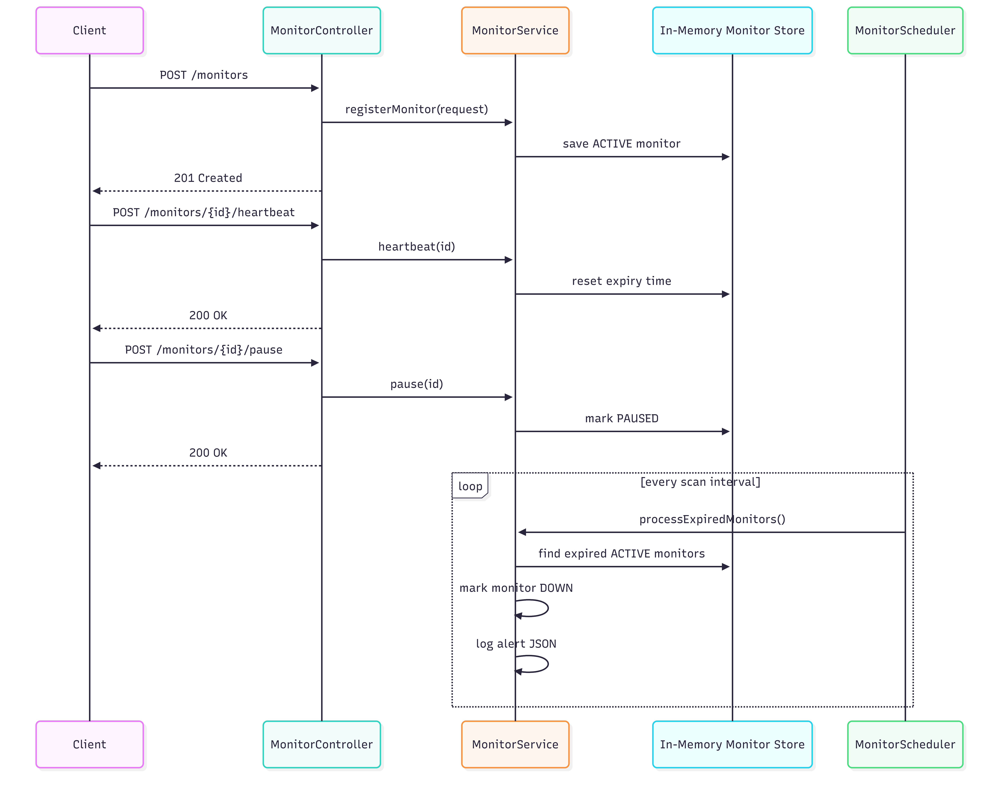

# Pulse-Check API

A Spring Boot watchdog service for monitoring remote devices with heartbeat-based liveness checks.

## Overview

Pulse-Check implements a dead man's switch pattern for unreliable environments. Devices register a monitor with a timeout window, send heartbeats to stay marked as healthy, and automatically transition to `down` when the server stops hearing from them.

## Architecture Diagram



## Tech Stack

- Java 17
- Spring Boot
- Bean Validation
- In-memory `ConcurrentHashMap`
- Scheduled monitor scanning
- Docker

## Setup Instructions

1. Open a terminal in `backend/Pulse-Check`
2. Start the application locally:

```bash
mvn spring-boot:run
```

If Maven wrapper works in your environment, you can also use:

```bash
./mvnw spring-boot:run
```

The API runs on:

```text
http://localhost:8080/api/v1
```

### Start with Docker

Prerequisite: make sure Docker Desktop or Docker Engine is running.

Build and run with Docker Compose:

```bash
docker compose up --build
```

Or build and run manually:

```bash
docker build -t pulse-check .
docker run -p 8080:8080 pulse-check
```

Stop the containerized application:

```bash
docker compose down
```

## API Documentation

### `POST /api/v1/monitors`

Registers a new monitor and starts its countdown timer.

Request:

```json
{
  "id": "device-123",
  "timeout": 60,
  "alert_email": "kabano@critmon.com"
}
```

Response: `201 Created`

```json
{
  "message": "Monitor registered successfully.",
  "monitor": {
    "id": "device-123",
    "timeout": 60,
    "alert_email": "kabano@critmon.com",
    "status": "active"
  }
}
```

### `POST /api/v1/monitors/{id}/heartbeat`

Resets the timer and keeps the device marked as active. If the monitor was paused, heartbeat automatically resumes monitoring.

Response: `200 OK`

```json
{
  "message": "Heartbeat received. Monitor timer reset.",
  "monitor": {
    "id": "device-123",
    "status": "active"
  }
}
```

### `POST /api/v1/monitors/{id}/pause`

Pauses monitoring so no alert fires while maintenance is in progress.

Response: `200 OK`

```json
{
  "message": "Monitor paused successfully.",
  "monitor": {
    "id": "device-123",
    "status": "paused"
  }
}
```

### `GET /api/v1/monitors`

Returns all registered monitors.

Response: `200 OK`

### `GET /api/v1/monitors/{id}`

Returns the current state of a single monitor, including status, expiry, and remaining seconds.

Response: `200 OK`

### Alert Behavior

When a monitor expires without receiving a heartbeat, the service logs an alert like:

```json
{"ALERT":"Device device-123 is down!","time":"2026-04-26T10:13:08Z","alert_email":"kabano@critmon.com"}
```

The monitor status is updated to `down`.

## Error Responses

- `400 Bad Request` for invalid input
- `404 Not Found` when a monitor does not exist
- `409 Conflict` when registering a duplicate monitor id

## Design Decisions

- **Encapsulated monitor lifecycle in the model** so heartbeat, pause, and down-state behavior stay close to the data they affect
- **Used an in-memory concurrent store** to keep the implementation simple and fast for the challenge
- **Separated controller, service, DTO, model, scheduler, and exception packages** for maintainability
- **Used scheduled expiry scanning** instead of one thread per monitor to keep the monitoring approach predictable and lightweight

## The Developer's Choice

I added **read endpoints for monitor visibility**:

- `GET /api/v1/monitors`
- `GET /api/v1/monitors/{id}`

Why this improves the system:

- operators can inspect current monitor state without digging through logs
- support teams can confirm whether a device is active, paused, or down in real time
- the API becomes easier to debug and demonstrate in Postman
